# Appendix A: Flow Documentation (Mermaid)

**Companion to:** Requirements Documentation v4.0

> All diagrams are compatible with GitHub, Azure DevOps, and the Mermaid Live Editor
> ([mermaid.live](https://mermaid.live)).

## Table of Contents

- [A.1 System & Deployment Flows](#a1-system--deployment-flows)
- [A.2 Data Model](#a2-data-model)
- [A.3 Authentication & Session Flows](#a3-authentication--session-flows)
- [A.4 Vehicle & Driver Lifecycle](#a4-vehicle--driver-lifecycle)
- [A.5 Trip & Revenue Sync](#a5-trip--revenue-sync)
- [A.6 Billing & Payment](#a6-billing--payment)
- [A.7 Incident & Complaint Management](#a7-incident--complaint-management)
- [A.8 Analytics & Reporting Flows](#a8-analytics--reporting-flows)
- [A.9 Mobile App Flows](#a9-mobile-app-flows)
- [A.10 Azure Functions Orchestration](#a10-azure-functions-orchestration)
- [A.11 Mapon Mock — Contract Testing Flow](#a11-mapon-mock--contract-testing-flow)
- [A.12 Summary of Diagrams](#a12-summary-of-diagrams)
- [A.13 Conventions Used](#a13-conventions-used)

---

## A.1 System & Deployment Flows

### A.1.1 High-Level System Architecture

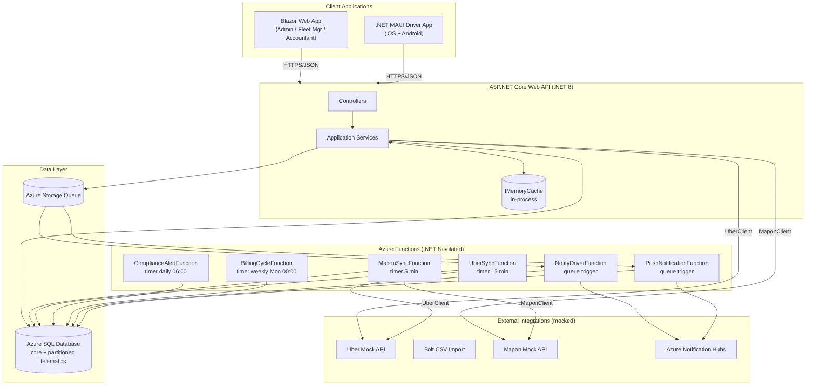
```mermaid
flowchart TB
    subgraph Clients["Client Applications"]
        Blazor["Blazor Web App<br/>(Admin / Fleet Mgr / Accountant)"]
        MAUI[".NET MAUI Driver App<br/>(iOS + Android)"]
    end

    subgraph API["ASP.NET Core Web API (.NET 8)"]
        Controllers["Controllers"]
        Services["Application Services"]
        Cache[("IMemoryCache<br/>in-process")]
        Controllers --> Services
        Services <--> Cache
    end

    subgraph Functions["Azure Functions (.NET 8 isolated)"]
        FnMapon["MaponSyncFunction<br/>timer 5 min"]
        FnUber["UberSyncFunction<br/>timer 15 min"]
        FnCompliance["ComplianceAlertFunction<br/>timer daily 06:00"]
        FnBilling["BillingCycleFunction<br/>timer weekly Mon 00:00"]
        FnNotify["NotifyDriverFunction<br/>queue trigger"]
        FnPush["PushNotificationFunction<br/>queue trigger"]
    end

    subgraph Data["Data Layer"]
        SQL[("Azure SQL Database<br/>core + partitioned telematics")]
        Queue[("Azure Storage Queue")]
    end

    subgraph External["External Integrations (mocked)"]
        UberMock["Uber Mock API"]
        BoltCSV["Bolt CSV Import"]
        MaponMock["Mapon Mock API"]
        NotifHub["Azure Notification Hubs"]
    end

    Blazor -->|HTTPS/JSON| API
    MAUI -->|HTTPS/JSON| API

    Services --> SQL
    Services --> Queue
    Services -->|MaponClient| MaponMock
    Services -->|UberClient| UberMock

    FnMapon -->|MaponClient| MaponMock
    FnMapon --> SQL
    FnUber -->|UberClient| UberMock
    FnUber --> SQL
    FnCompliance --> SQL
    FnBilling --> SQL
    FnNotify --> NotifHub
    FnPush --> NotifHub
    FnNotify --> SQL
    FnPush --> SQL

    Queue --> FnNotify
    Queue --> FnPush
```

### A.1.2 Deployment Topology (Production)

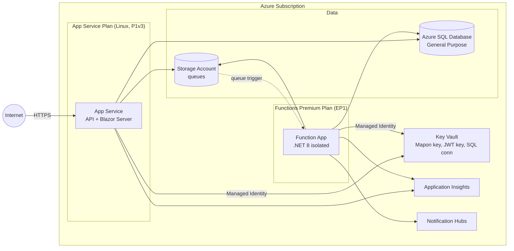
```mermaid
flowchart LR
    subgraph Azure["Azure Subscription"]
        subgraph AppSvc["App Service Plan (Linux, P1v3)"]
            WebApp["App Service<br/>API + Blazor Server"]
        end

        subgraph FnPlan["Functions Premium Plan (EP1)"]
            FnApp["Function App<br/>.NET 8 isolated"]
        end

        subgraph DataLayer["Data"]
            SQLDB[("Azure SQL Database<br/>General Purpose")]
            Storage[("Storage Account<br/>queues")]
        end

        KeyVault["Key Vault<br/>Mapon key, JWT key, SQL conn"]
        AppInsights["Application Insights"]
        NotifHubs["Notification Hubs"]
    end

    Internet(("Internet")) -->|HTTPS| WebApp
    WebApp -->|Managed Identity| KeyVault
    WebApp --> SQLDB
    WebApp --> Storage
    WebApp --> AppInsights

    FnApp -->|Managed Identity| KeyVault
    FnApp --> SQLDB
    FnApp --> Storage
    FnApp --> NotifHubs
    FnApp --> AppInsights

    Storage -.->|queue trigger| FnApp
```

---

## A.2 Data Model

### A.2.1 Entity-Relationship Diagram (Core)

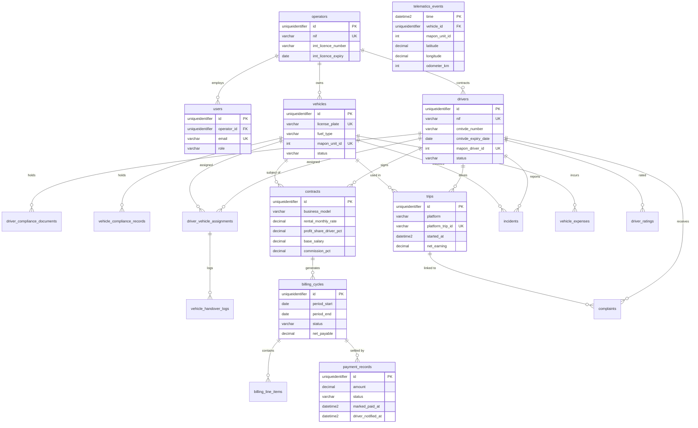
```mermaid
erDiagram
    operators ||--o{ users : "employs"
    operators ||--o{ drivers : "contracts"
    operators ||--o{ vehicles : "owns"
    drivers ||--o{ driver_compliance_documents : "holds"
    vehicles ||--o{ vehicle_compliance_records : "holds"
    drivers ||--o{ driver_vehicle_assignments : "assigned"
    vehicles ||--o{ driver_vehicle_assignments : "assigned"
    driver_vehicle_assignments ||--o{ vehicle_handover_logs : "logs"

    drivers ||--o{ contracts : "signs"
    vehicles ||--o{ contracts : "subject of"
    contracts ||--o{ billing_cycles : "generates"
    billing_cycles ||--o{ billing_line_items : "contains"
    billing_cycles ||--o{ payment_records : "settled by"

    drivers ||--o{ trips : "drives"
    vehicles ||--o{ trips : "used in"
    drivers ||--o{ incidents : "reports"
    vehicles ||--o{ incidents : "involves"
    vehicles ||--o{ vehicle_expenses : "incurs"
    drivers ||--o{ driver_ratings : "rated"
    drivers ||--o{ complaints : "receives"
    trips ||--o{ complaints : "linked to"

    operators {
        uniqueidentifier id PK
        varchar nif UK
        varchar imt_licence_number
        date imt_licence_expiry
    }
    users {
        uniqueidentifier id PK
        uniqueidentifier operator_id FK
        varchar email UK
        varchar role
    }
    drivers {
        uniqueidentifier id PK
        varchar nif UK
        varchar cmtvde_number
        date cmtvde_expiry_date
        int mapon_driver_id UK
        varchar status
    }
    vehicles {
        uniqueidentifier id PK
        varchar license_plate UK
        varchar fuel_type
        int mapon_unit_id UK
        varchar status
    }
    contracts {
        uniqueidentifier id PK
        varchar business_model
        decimal rental_monthly_rate
        decimal profit_share_driver_pct
        decimal base_salary
        decimal commission_pct
    }
    billing_cycles {
        uniqueidentifier id PK
        date period_start
        date period_end
        varchar status
        decimal net_payable
    }
    payment_records {
        uniqueidentifier id PK
        decimal amount
        varchar status
        datetime2 marked_paid_at
        datetime2 driver_notified_at
    }
    trips {
        uniqueidentifier id PK
        varchar platform
        varchar platform_trip_id UK
        datetime2 started_at
        decimal net_earning
    }
    telematics_events {
        datetime2 time PK
        uniqueidentifier vehicle_id FK
        int mapon_unit_id
        decimal latitude
        decimal longitude
        int odometer_km
    }
```

### A.2.2 Telematics Partition Scheme

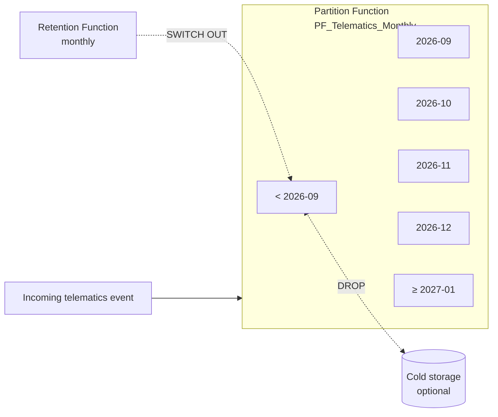
```mermaid
flowchart LR
    subgraph PF["Partition Function<br/>PF_Telematics_Monthly"]
        direction TB
        P1["&lt; 2026-09"]
        P2["2026-09"]
        P3["2026-10"]
        P4["2026-11"]
        P5["2026-12"]
        P6["≥ 2027-01"]
    end

    Insert["Incoming telematics event"] --> PF
    PF --> P1
    PF --> P2
    PF --> P3
    PF --> P4
    PF --> P5
    PF --> P6

    Retention["Retention Function<br/>monthly"] -.->|SWITCH OUT| P1
    P1 -.->|DROP| Archive[("Cold storage<br/>optional")]
```

---

## A.3 Authentication & Session Flows

### A.3.1 Login & Token Lifecycle

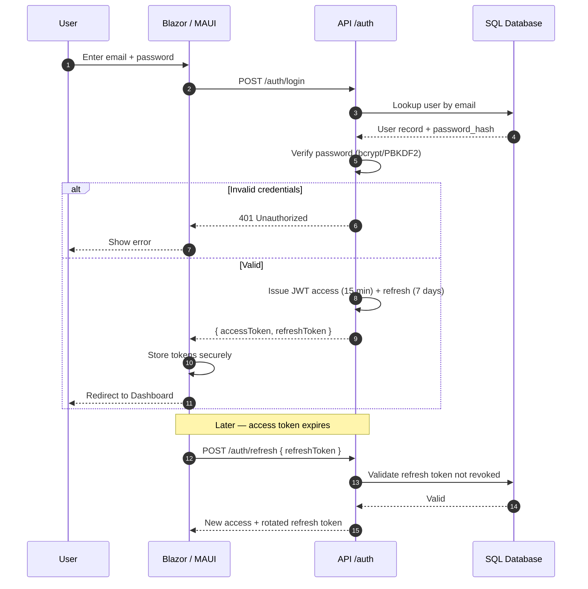
```mermaid
sequenceDiagram
    autonumber
    participant U as User
    participant B as Blazor / MAUI
    participant API as API /auth
    participant DB as SQL Database

    U->>B: Enter email + password
    B->>API: POST /auth/login
    API->>DB: Lookup user by email
    DB-->>API: User record + password_hash
    API->>API: Verify password (bcrypt/PBKDF2)
    alt Invalid credentials
        API-->>B: 401 Unauthorized
        B-->>U: Show error
    else Valid
        API->>API: Issue JWT access (15 min) + refresh (7 days)
        API-->>B: { accessToken, refreshToken }
        B->>B: Store tokens securely
        B-->>U: Redirect to Dashboard
    end

    Note over B,API: Later — access token expires

    B->>API: POST /auth/refresh { refreshToken }
    API->>DB: Validate refresh token not revoked
    DB-->>API: Valid
    API-->>B: New access + rotated refresh token
```

### A.3.2 RBAC Authorization

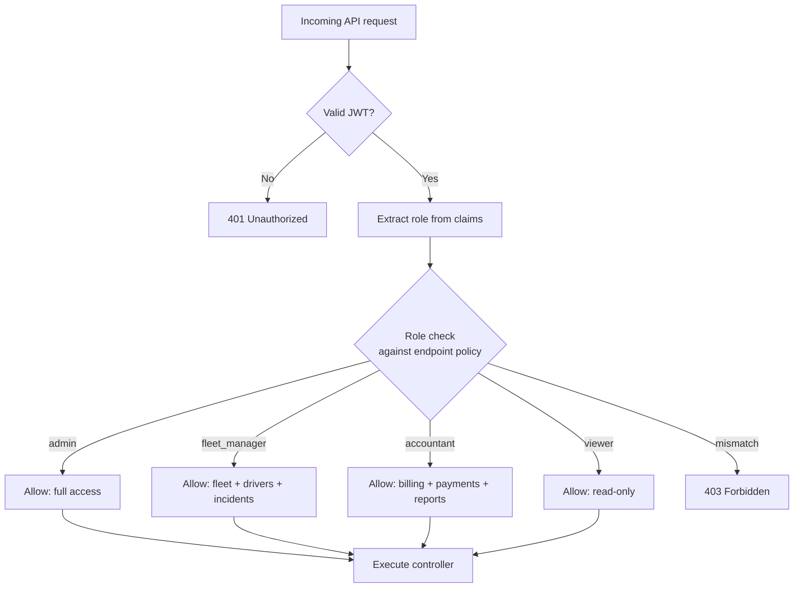
```mermaid
flowchart TD
    Req["Incoming API request"] --> AuthN{"Valid JWT?"}
    AuthN -->|No| R401["401 Unauthorized"]
    AuthN -->|Yes| Extract["Extract role from claims"]
    Extract --> Role{"Role check<br/>against endpoint policy"}

    Role -->|admin| Allow["Allow: full access"]
    Role -->|fleet_manager| Allow2["Allow: fleet + drivers + incidents"]
    Role -->|accountant| Allow3["Allow: billing + payments + reports"]
    Role -->|viewer| Allow4["Allow: read-only"]
    Role -->|mismatch| R403["403 Forbidden"]

    Allow --> Handler["Execute controller"]
    Allow2 --> Handler
    Allow3 --> Handler
    Allow4 --> Handler
```

---

## A.4 Vehicle & Driver Lifecycle

### A.4.1 Vehicle Onboarding

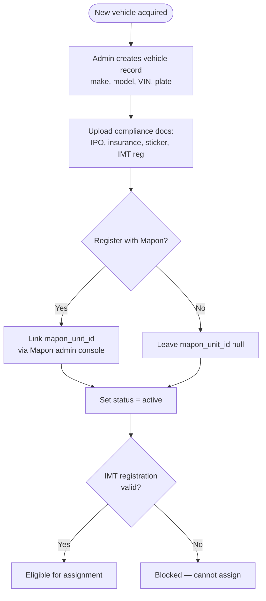
```mermaid
flowchart TD
    Start(["New vehicle acquired"]) --> Create["Admin creates vehicle record<br/>make, model, VIN, plate"]
    Create --> Upload["Upload compliance docs:<br/>IPO, insurance, sticker, IMT reg"]
    Upload --> Mapon{"Register with Mapon?"}
    Mapon -->|Yes| MaponLink["Link mapon_unit_id<br/>via Mapon admin console"]
    Mapon -->|No| SkipMapon["Leave mapon_unit_id null"]
    MaponLink --> Status["Set status = active"]
    SkipMapon --> Status
    Status --> Eligible{"IMT registration<br/>valid?"}
    Eligible -->|Yes| Ready["Eligible for assignment"]
    Eligible -->|No| Blocked["Blocked — cannot assign"]
```

### A.4.2 Vehicle Assignment & Handover

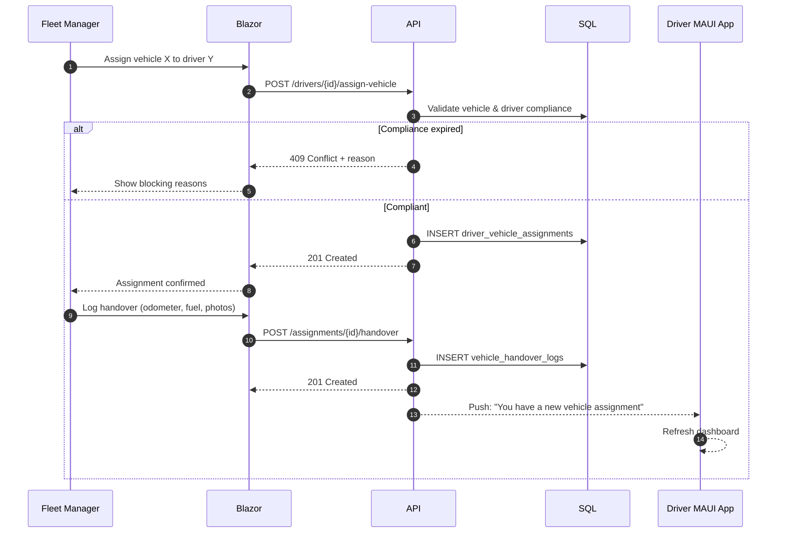
```mermaid
sequenceDiagram
    autonumber
    participant FM as Fleet Manager
    participant B as Blazor
    participant API as API
    participant DB as SQL
    participant MAUI as Driver MAUI App

    FM->>B: Assign vehicle X to driver Y
    B->>API: POST /drivers/{id}/assign-vehicle
    API->>DB: Validate vehicle & driver compliance
    alt Compliance expired
        API-->>B: 409 Conflict + reason
        B-->>FM: Show blocking reasons
    else Compliant
        API->>DB: INSERT driver_vehicle_assignments
        API-->>B: 201 Created
        B-->>FM: Assignment confirmed

        FM->>B: Log handover (odometer, fuel, photos)
        B->>API: POST /assignments/{id}/handover
        API->>DB: INSERT vehicle_handover_logs
        API-->>B: 201 Created

        API-->>MAUI: Push: "You have a new vehicle assignment"
        MAUI-->>MAUI: Refresh dashboard
    end
```

### A.4.3 Driver Onboarding & CMTVDE Compliance

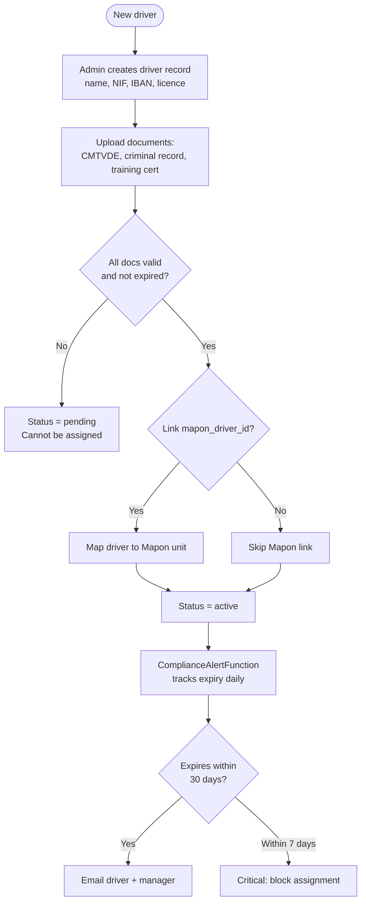
```mermaid
flowchart TD
    Start(["New driver"]) --> Create["Admin creates driver record<br/>name, NIF, IBAN, licence"]
    Create --> Upload["Upload documents:<br/>CMTVDE, criminal record, training cert"]
    Upload --> Verify{"All docs valid<br/>and not expired?"}
    Verify -->|No| Pending["Status = pending<br/>Cannot be assigned"]
    Verify -->|Yes| Mapon{"Link mapon_driver_id?"}
    Mapon -->|Yes| Link["Map driver to Mapon unit"]
    Mapon -->|No| Skip["Skip Mapon link"]
    Link --> Active["Status = active"]
    Skip --> Active
    Active --> Alert["ComplianceAlertFunction<br/>tracks expiry daily"]
    Alert --> Expiring{"Expires within<br/>30 days?"}
    Expiring -->|Yes| Warn["Email driver + manager"]
    Expiring -->|Within 7 days| Block["Critical: block assignment"]
```

### A.4.4 Compliance Alert Engine (Daily)

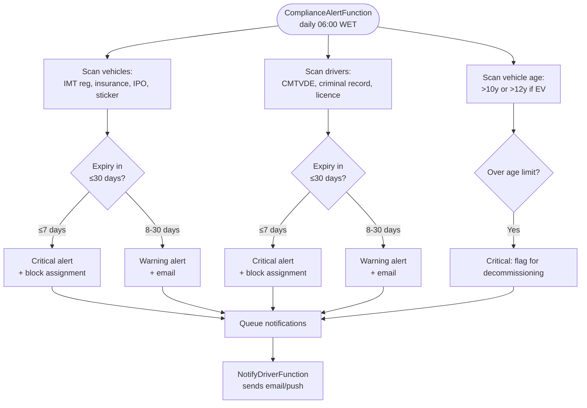
```mermaid
flowchart TD
    Timer(["ComplianceAlertFunction<br/>daily 06:00 WET"]) --> ScanV["Scan vehicles:<br/>IMT reg, insurance, IPO, sticker"]
    Timer --> ScanD["Scan drivers:<br/>CMTVDE, criminal record, licence"]
    Timer --> ScanAge["Scan vehicle age:<br/>&gt;10y or &gt;12y if EV"]

    ScanV --> VExp{"Expiry in<br/>≤30 days?"}
    ScanD --> DExp{"Expiry in<br/>≤30 days?"}
    ScanAge --> AgeFlag{"Over age limit?"}

    VExp -->|≤7 days| VCrit["Critical alert<br/>+ block assignment"]
    VExp -->|8-30 days| VWarn["Warning alert<br/>+ email"]
    DExp -->|≤7 days| DCrit["Critical alert<br/>+ block assignment"]
    DExp -->|8-30 days| DWarn["Warning alert<br/>+ email"]
    AgeFlag -->|Yes| AgeCrit["Critical: flag for decommissioning"]

    VCrit --> Notify["Queue notifications"]
    VWarn --> Notify
    DCrit --> Notify
    DWarn --> Notify
    AgeCrit --> Notify
    Notify --> Send["NotifyDriverFunction<br/>sends email/push"]
```

---

## A.5 Trip & Revenue Sync

### A.5.1 Uber Sync (Timer Function)

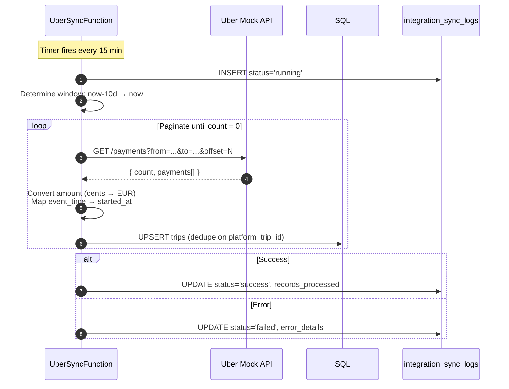
```mermaid
sequenceDiagram
    autonumber
    participant Fn as UberSyncFunction
    participant API as Uber Mock API
    participant DB as SQL
    participant Log as integration_sync_logs

    Note over Fn: Timer fires every 15 min
    Fn->>Log: INSERT status='running'
    Fn->>Fn: Determine window: now-10d → now

    loop Paginate until count = 0
        Fn->>API: GET /payments?from=...&to=...&offset=N
        API-->>Fn: { count, payments[] }
        Fn->>Fn: Convert amount (cents → EUR)<br/>Map event_time → started_at
        Fn->>DB: UPSERT trips (dedupe on platform_trip_id)
    end

    alt Success
        Fn->>Log: UPDATE status='success', records_processed
    else Error
        Fn->>Log: UPDATE status='failed', error_details
    end
```

### A.5.2 Bolt CSV Import (Synchronous)

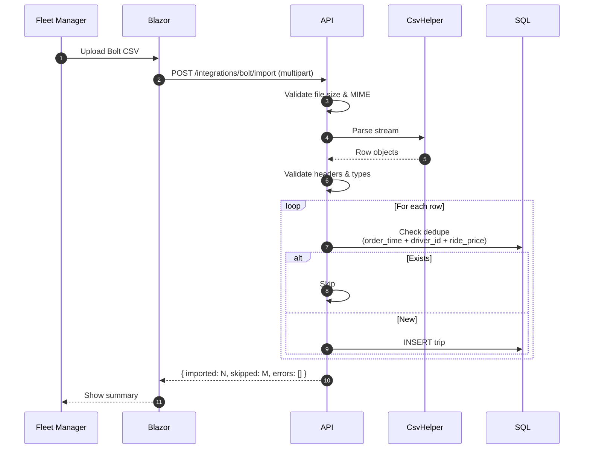
```mermaid
sequenceDiagram
    autonumber
    participant FM as Fleet Manager
    participant B as Blazor
    participant API as API
    participant CSV as CsvHelper
    participant DB as SQL

    FM->>B: Upload Bolt CSV
    B->>API: POST /integrations/bolt/import (multipart)
    API->>API: Validate file size & MIME
    API->>CSV: Parse stream
    CSV-->>API: Row objects
    API->>API: Validate headers & types

    loop For each row
        API->>DB: Check dedupe<br/>(order_time + driver_id + ride_price)
        alt Exists
            API->>API: Skip
        else New
            API->>DB: INSERT trip
        end
    end

    API-->>B: { imported: N, skipped: M, errors: [] }
    B-->>FM: Show summary
```

### A.5.3 Mapon Sync (Timer Function, Provider-Agnostic)

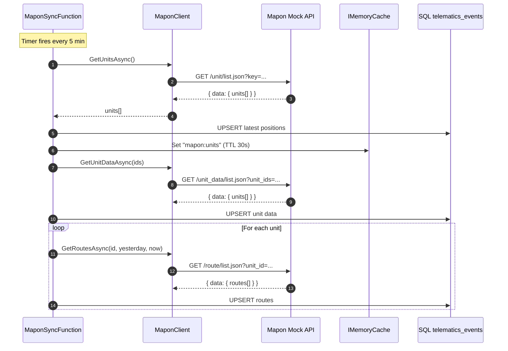
```mermaid
sequenceDiagram
    autonumber
    participant Fn as MaponSyncFunction
    participant Client as MaponClient
    participant Mock as Mapon Mock API
    participant Cache as IMemoryCache
    participant DB as SQL telematics_events

    Note over Fn: Timer fires every 5 min
    Fn->>Client: GetUnitsAsync()
    Client->>Mock: GET /unit/list.json?key=...
    Mock-->>Client: { data: { units[] } }
    Client-->>Fn: units[]
    Fn->>DB: UPSERT latest positions
    Fn->>Cache: Set "mapon:units" (TTL 30s)

    Fn->>Client: GetUnitDataAsync(ids)
    Client->>Mock: GET /unit_data/list.json?unit_ids=...
    Mock-->>Client: { data: { units[] } }
    Fn->>DB: UPSERT unit data

    loop For each unit
        Fn->>Client: GetRoutesAsync(id, yesterday, now)
        Client->>Mock: GET /route/list.json?unit_id=...
        Mock-->>Client: { data: { routes[] } }
        Fn->>DB: UPSERT routes
    end
```

### A.5.4 Mapon Mock Server Internals

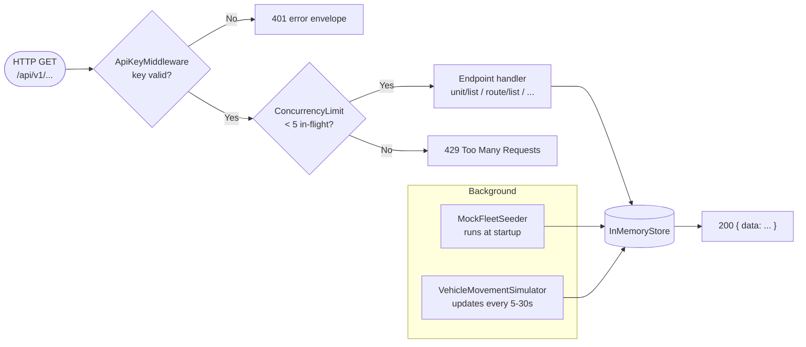
```mermaid
flowchart LR
    Request(["HTTP GET<br/>/api/v1/..."]) --> Auth{"ApiKeyMiddleware<br/>key valid?"}
    Auth -->|No| R401["401 error envelope"]
    Auth -->|Yes| Limit{"ConcurrencyLimit<br/>&lt; 5 in-flight?"}
    Limit -->|No| R429["429 Too Many Requests"]
    Limit -->|Yes| Handler["Endpoint handler<br/>unit/list / route/list / ..."]
    Handler --> Store[("InMemoryStore")]
    Store --> Response["200 { data: ... }"]

    subgraph Background
        Simulator["VehicleMovementSimulator<br/>updates every 5-30s"]
        Seeder["MockFleetSeeder<br/>runs at startup"]
    end
    Seeder --> Store
    Simulator --> Store
```

---

## A.6 Billing & Payment

### A.6.1 Billing Cycle Generation — Model 1: Rental

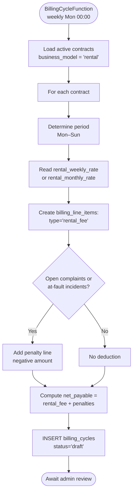
```mermaid
flowchart TD
    Trigger(["BillingCycleFunction<br/>weekly Mon 00:00"]) --> Load["Load active contracts<br/>business_model = 'rental'"]
    Load --> Loop["For each contract"]

    Loop --> Period["Determine period<br/>Mon–Sun"]
    Period --> Rate["Read rental_weekly_rate<br/>or rental_monthly_rate"]
    Rate --> Line["Create billing_line_items:<br/>type='rental_fee'"]
    Line --> Penalties{"Open complaints or<br/>at-fault incidents?"}
    Penalties -->|Yes| Deduct["Add penalty line<br/>negative amount"]
    Penalties -->|No| Skip["No deduction"]
    Deduct --> Total["Compute net_payable =<br/>rental_fee + penalties"]
    Skip --> Total
    Total --> Save["INSERT billing_cycles<br/>status='draft'"]
    Save --> End(["Await admin review"])
```

### A.6.2 Billing Cycle Generation — Model 2: Profit Share

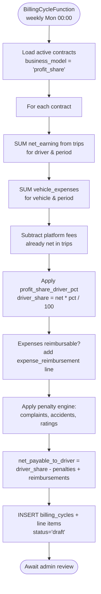
```mermaid
flowchart TD
    Trigger(["BillingCycleFunction<br/>weekly Mon 00:00"]) --> Load["Load active contracts<br/>business_model = 'profit_share'"]
    Load --> Loop["For each contract"]

    Loop --> Rev["SUM net_earning from trips<br/>for driver &amp; period"]
    Rev --> Exp["SUM vehicle_expenses<br/>for vehicle &amp; period"]
    Exp --> Platform["Subtract platform fees<br/>already net in trips"]

    Platform --> Split["Apply profit_share_driver_pct<br/>driver_share = net * pct / 100"]
    Split --> Reimburse["Expenses reimbursable?<br/>add expense_reimbursement line"]

    Reimburse --> Penalties["Apply penalty engine:<br/>complaints, accidents, ratings"]
    Penalties --> Total["net_payable_to_driver =<br/>driver_share - penalties + reimbursements"]
    Total --> Save["INSERT billing_cycles + line items<br/>status='draft'"]
    Save --> End(["Await admin review"])
```

### A.6.3 Billing Cycle Generation — Model 3: Salary + Percentage

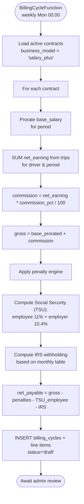
```mermaid
flowchart TD
    Trigger(["BillingCycleFunction<br/>weekly Mon 00:00"]) --> Load["Load active contracts<br/>business_model = 'salary_plus'"]
    Load --> Loop["For each contract"]

    Loop --> Base["Prorate base_salary<br/>for period"]
    Base --> Rev["SUM net_earning from trips<br/>for driver &amp; period"]
    Rev --> Commission["commission = net_earning * commission_pct / 100"]
    Commission --> Gross["gross = base_prorated + commission"]

    Gross --> Penalties["Apply penalty engine"]
    Penalties --> Social["Compute Social Security (TSU):<br/>employee 11% + employer 10.4%"]
    Social --> IRS["Compute IRS withholding<br/>based on monthly table"]
    IRS --> Net["net_payable = gross - penalties - TSU_employee - IRS"]
    Net --> Save["INSERT billing_cycles + line items<br/>status='draft'"]
    Save --> End(["Await admin review"])
```

### A.6.4 Penalty & Bonus Engine

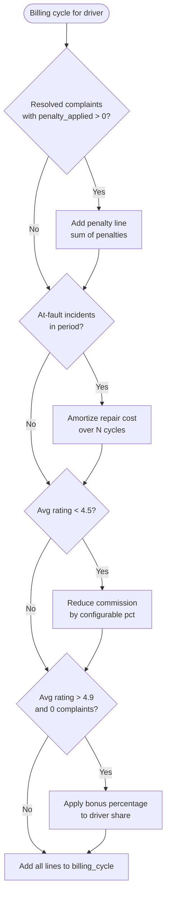
```mermaid
flowchart TD
    In(["Billing cycle for driver"]) --> C1{"Resolved complaints<br/>with penalty_applied &gt; 0?"}
    C1 -->|Yes| P1["Add penalty line<br/>sum of penalties"]
    C1 -->|No| C2

    C2{"At-fault incidents<br/>in period?"} -->|Yes| P2["Amortize repair cost<br/>over N cycles"]
    C2 -->|No| C3
    P2 --> C3

    C3{"Avg rating &lt; 4.5?"} -->|Yes| P3["Reduce commission<br/>by configurable pct"]
    C3 -->|No| C4
    P3 --> C4

    C4{"Avg rating &gt; 4.9<br/>and 0 complaints?"} -->|Yes| B1["Apply bonus percentage<br/>to driver share"]
    C4 -->|No| Done
    B1 --> Done["Add all lines to billing_cycle"]

    P1 --> C2
```

### A.6.5 Manual Payment Workflow

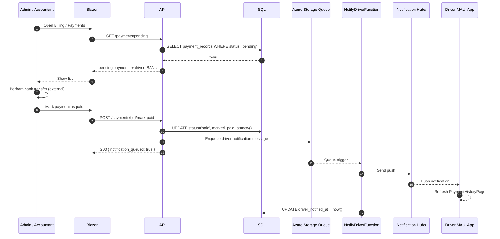
```mermaid
sequenceDiagram
    autonumber
    participant Admin as Admin / Accountant
    participant B as Blazor
    participant API as API
    participant DB as SQL
    participant Q as Azure Storage Queue
    participant Fn as NotifyDriverFunction
    participant NH as Notification Hubs
    participant MAUI as Driver MAUI App

    Admin->>B: Open Billing / Payments
    B->>API: GET /payments/pending
    API->>DB: SELECT payment_records WHERE status='pending'
    DB-->>API: rows
    API-->>B: pending payments + driver IBANs
    B-->>Admin: Show list

    Admin->>Admin: Perform bank transfer (external)
    Admin->>B: Mark payment as paid
    B->>API: POST /payments/{id}/mark-paid
    API->>DB: UPDATE status='paid', marked_paid_at=now()
    API->>Q: Enqueue driver-notification message
    API-->>B: 200 { notification_queued: true }

    Q-->>Fn: Queue trigger
    Fn->>NH: Send push
    NH-->>MAUI: Push notification
    MAUI-->>MAUI: Refresh PaymentHistoryPage
    Fn->>DB: UPDATE driver_notified_at = now()
```

### A.6.6 Payment Lifecycle State Machine

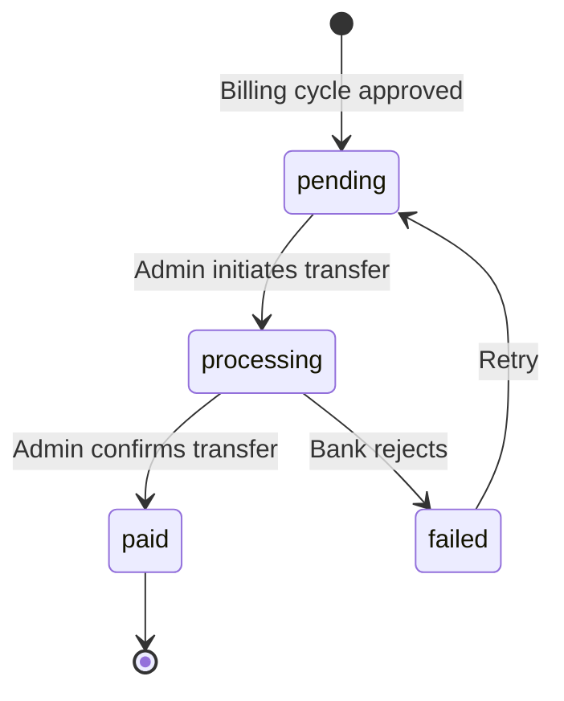
```mermaid
stateDiagram-v2
    [*] --> pending: Billing cycle approved
    pending --> processing: Admin initiates transfer
    processing --> paid: Admin confirms transfer
    processing --> failed: Bank rejects
    failed --> pending: Retry
    paid --> [*]
```

---

## A.7 Incident & Complaint Management

### A.7.1 Driver Reports Incident

```mermaid
sequenceDiagram
    autonumber
    participant D as Driver (MAUI)
    participant API as API
    participant Blob as Blob Storage
    participant DB as SQL
    participant FM as Fleet Manager

    D->>D: Open Report Incident page
    D->>D: Capture photos + GPS
    D->>API: POST /incidents (multipart)
    API->>Blob: Upload photos → URLs
    API->>DB: INSERT incidents<br/>status='reported'
    API-->>D: 201 Created

    API-->>FM: (via dashboard refresh)
    FM->>FM: Review incident
    FM->>API: PUT /incidents/{id}<br/>{ at_fault, repair_cost, status='resolved' }
    API->>DB: UPDATE incidents
    Note over API: If at_fault=true,<br/>penalty will be applied<br/>in next billing cycle
```

### A.7.2 Customer Complaint → Penalty Flow

```mermaid
flowchart TD
    Start(["Complaint received<br/>from platform or customer"]) --> Log["Admin logs via Blazor:<br/>POST /complaints"]
    Log --> Triage["Admin triages<br/>severity, type"]
    Triage --> Investigate{"Substantiated?"}
    Investigate -->|No| Dismiss["status='dismissed'<br/>no penalty"]
    Investigate -->|Yes| Resolve["Admin resolves:<br/>PUT /complaints/{id}/resolve"]
    Resolve --> Penalty{"Penalty amount?"}
    Penalty -->|0| NoPenalty["No impact on earnings"]
    Penalty -->|>0| Apply["Set penalty_applied"]
    Apply --> Store["Stored for next<br/>billing cycle"]
    Store --> Billing["BillingCycleFunction<br/>picks up penalty"]
    Billing --> Deduct["Deducted from driver's share"]
```

---

## A.8 Analytics & Reporting Flows

### A.8.1 Fleet Analytics Pipeline

```mermaid
flowchart LR
    subgraph Sources
        T[("trips")]
        E[("vehicle_expenses")]
        I[("incidents")]
        R[("driver_ratings")]
        TE[("telematics_events<br/>columnstore")]
    end

    Sources --> Agg["AnalyticsService<br/>aggregates per vehicle/period"]
    Agg --> Score["Vehicle Score =<br/>0.4·revenue_km + 0.3·rating<br/>− 0.2·cost_km − 0.1·complaints/100"]
    Score --> Cache[("IMemoryCache<br/>TTL 5 min")]
    Cache --> API["GET /analytics/vehicle-comparison"]
    API --> Blazor["Blazor Dashboard"]
```

### A.8.2 Tax Export (IVA / IRS)

```mermaid
sequenceDiagram
    autonumber
    participant Acc as Accountant
    participant B as Blazor
    participant API as API
    participant DB as SQL
    participant CSV as Export builder

    Acc->>B: Select period + report type
    B->>API: GET /reports/tax-export?period=...
    API->>DB: SELECT trips, billing_cycles,<br/>payment_records for period
    DB-->>API: rows
    API->>CSV: Build CSV (IVA 6% detail, IRS withholding)
    CSV-->>API: file stream
    API-->>B: File download
    B-->>Acc: Download .csv
    Note over Acc: Submit to accountant<br/>(no direct integration)
```

---

## A.9 Mobile App Flows

### A.9.1 Offline Expense Logging & Sync

```mermaid
sequenceDiagram
    autonumber
    participant D as Driver
    participant App as MAUI App
    participant Local as Local SQLite
    participant API as API
    participant Blob as Blob Storage

    D->>App: Log expense (offline)
    App->>App: Capture GPS + photo
    App->>Local: INSERT pending expense
    App-->>D: Saved locally (pending badge)

    Note over App: Connectivity restored

    App->>API: POST /expenses (queued batch)
    API->>Blob: Upload photo
    API->>API: Persist expense
    API-->>App: 201 Created

    App->>Local: Mark expense as synced
    App-->>D: Badge cleared
```

### A.9.2 Driver App Screen Flow

```mermaid
flowchart TD
    Login["LoginPage"] --> Dash["DashboardPage"]
    Dash --> MyVeh["My Vehicle"]
    Dash --> Trips["Trip List"]
    Dash --> Earnings["My Earnings"]
    Dash --> Payment["Payment Status"]
    Dash --> Comp["Compliance Docs"]
    Dash --> Expense["Log Expense"]
    Dash --> Incident["Report Incident"]

    Expense --> GPS["Capture GPS + photo"]
    GPS --> Save["Save locally, then sync"]
    Incident --> GP2["Capture GPS + photo"]
    GP2 --> Save2["Save locally, then sync"]

    Payment --> Notif{"Push received?"}
    Notif -->|Yes| Refresh["Refresh payment list"]
```

---

## A.10 Azure Functions Orchestration

### A.10.1 Timer Schedule Overview

```mermaid
gantt
    title Daily/Weekly Timer Schedule (WET)
    dateFormat HH:mm
    axisFormat %H:%M

    section Every 5 min
    MaponSyncFunction      :00:00, 24h

    section Every 15 min
    UberSyncFunction       :00:00, 24h

    section Daily
    ComplianceAlertFunction :crit, 06:00, 30m
    RatingSyncFunction      :02:00, 30m

    section Weekly
    BillingCycleFunction    :crit, 00:00, 2h
    TelematicsRetentionFn   :04:00, 1h
```

### A.10.2 Function Failure & Retry

```mermaid
flowchart TD
    Invoke(["Function invocation"]) --> Run["Execute"]
    Run --> Ok{"Success?"}
    Ok -->|Yes| Log["Log success<br/>to background_job_logs"]
    Ok -->|No| Retry{"Retries left?<br/>max 3"}
    Retry -->|Yes| Backoff["Exponential backoff<br/>2^n seconds"]
    Backoff --> Run
    Retry -->|No| DLQ["Move to dead-letter queue"]
    DLQ --> Alert["Send alert<br/>via App Insights"]
    DLQ --> LogFail["Log failed<br/>with error_details"]
```

---

## A.11 Mapon Mock — Contract Testing Flow

```mermaid
sequenceDiagram
    autonumber
    participant Test as ContractTest
    participant Client as MaponClient
    participant Mock as MaponMock
    participant Fixtures as Recorded Fixtures

    Test->>Client: GetUnitsAsync()
    Client->>Mock: GET /unit/list.json?key=mock-key
    Mock-->>Client: { data: { units[] } }
    Client-->>Test: units[]
    Test->>Test: Assert schema matches Mapon contract

    Note over Test,Fixtures: Second pass — replay real fixtures

    Test->>Fixtures: Load real_response.json (redacted)
    Fixtures-->>Test: JSON
    Test->>Client: Deserialize via MaponEnvelope
    Client-->>Test: units[]
    Test->>Test: Assert identical schema

    Note over Test: CI also runs against<br/>real Mapon sandbox<br/>when available
```

---

## A.12 Summary of Diagrams

| # | Diagram | Type | Purpose |
|---|---|---|---|
| A.1.1 | System Architecture | flowchart | Whole-system component view |
| A.1.2 | Deployment Topology | flowchart | Azure production layout |
| A.2.1 | ERD (Core) | erDiagram | Database relationships |
| A.2.2 | Telematics Partition Scheme | flowchart | Partitioning & retention |
| A.3.1 | Login & Token Lifecycle | sequence | Auth flow |
| A.3.2 | RBAC Authorization | flowchart | Role-based access |
| A.4.1 | Vehicle Onboarding | flowchart | Vehicle registration |
| A.4.2 | Vehicle Assignment | sequence | Assignment + handover |
| A.4.3 | Driver Onboarding | flowchart | CMTVDE compliance |
| A.4.4 | Compliance Alert Engine | flowchart | Daily alert scan |
| A.5.1 | Uber Sync | sequence | Timer-based sync |
| A.5.2 | Bolt CSV Import | sequence | Synchronous import |
| A.5.3 | Mapon Sync | sequence | Timer-based telemetry |
| A.5.4 | Mapon Mock Internals | flowchart | Mock server behaviour |
| A.6.1 | Billing — Rental | flowchart | Model 1 |
| A.6.2 | Billing — Profit Share | flowchart | Model 2 |
| A.6.3 | Billing — Salary + % | flowchart | Model 3 |
| A.6.4 | Penalty & Bonus Engine | flowchart | Cross-model adjustments |
| A.6.5 | Manual Payment Workflow | sequence | Admin → driver notification |
| A.6.6 | Payment Lifecycle | stateDiagram | Payment state machine |
| A.7.1 | Incident Reporting | sequence | Driver → manager |
| A.7.2 | Complaint → Penalty | flowchart | Complaint resolution |
| A.8.1 | Fleet Analytics Pipeline | flowchart | Scoring pipeline |
| A.8.2 | Tax Export | sequence | IVA/IRS export |
| A.9.1 | Offline Expense Sync | sequence | MAUI offline flow |
| A.9.2 | Driver App Screens | flowchart | Navigation map |
| A.10.1 | Timer Schedule | gantt | Function schedules |
| A.10.2 | Function Failure & Retry | flowchart | Resiliency |
| A.11 | Mapon Contract Testing | sequence | Mock fidelity validation |

---

## A.13 Conventions Used

| Element | Meaning |
|---|---|
| **Rounded rectangle** `(["..."])` | Start / end of a flow |
| **Diamond** `{"..."}` | Decision point |
| **Cylinder** `[("...")]` | Data store (DB, cache, queue) |
| **Subgraph** | Logical grouping (context, module, environment) |
| **Solid arrow** `-->` | Synchronous call or direct dependency |
| **Dotted arrow** `-.->` | Asynchronous or optional path |
| **`autonumber`** in sequence diagrams | Ordered interaction steps |
| **`crit`** in Gantt | Critical schedule — alerting if missed |

---

*End of Appendix A — Flow Documentation (Mermaid).*